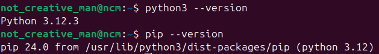
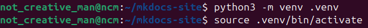
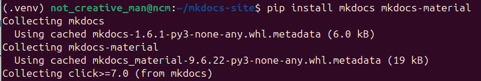
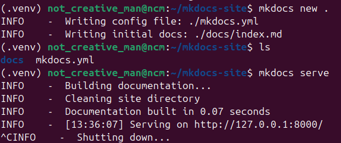
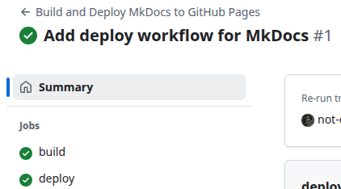
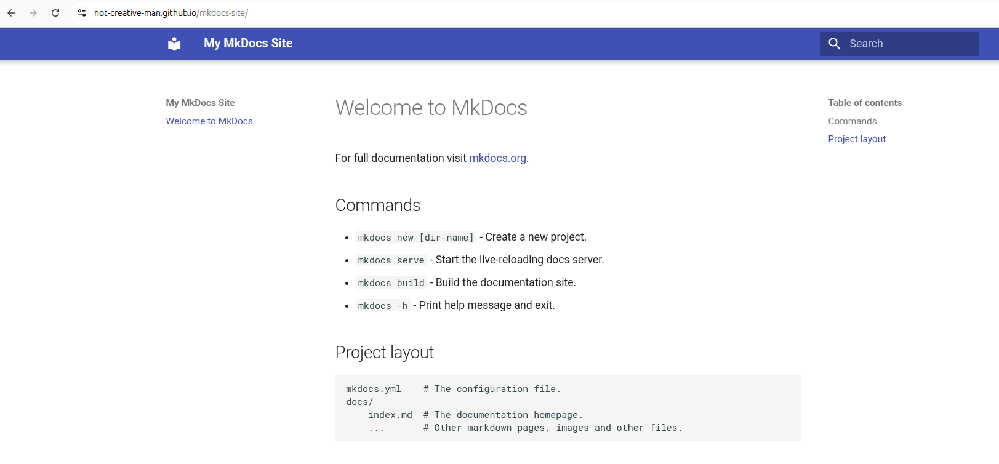

# Отчёт по заданию 2.1: Создание и развертывание статического сайта на GitHub Pages
Выполнил: Лебедев Иван

## 1. Ссылка на сайт
Сайт развернут и доступен по ссылке:
[https://not-creative-man.github.io/mkdocs-site/](https://not-creative-man.github.io/mkdocs-site/)

## 2. Подготовка локальной машины
Установка Python3 и pip и модуля venv. 

Создание и активация виртуального окружения:

Установка зависимостей mkdocs-material:

## 3. Создание проекта

Создан каталог mkdocs-site. 
Создание нового проекта MkDocs:

Отредактирован файл mkdocs.yml с указанием темы Material, а также создан .gitignore

## 4. Репозиторий на гитхаб

Создание нового репозитория и инициализация гита в проекте. Выполнение коммита:

## 5. Настройка GitHub Actions для деплоя

Создан файл deploy.yml в .github/workflows.
В настройках проекта во вкладке Pages выбрано: **Build and deploement - GitHub Actions**

Сайт по ссылке отображается корректно:

## 4. Исследовательская часть

### 4.1 Возможности использования отечественных CDN

Для ускорения доставки статического контента можно подключить CDN:
 - Яндекс CDN
 - Selectel CDN
 - Cloudflare (с локальным узлом в РФ)

### 4.2 Возможности Gitverse для CI/CD
- Gitverse позволяет автоматизировать сборку и деплой проектов, аналогично GitHub Actions или GitLab CI/CD
- Поддерживаются пайплайны для статических сайтов и Python-проектов

### 4.3 Варианты деплоя статического сайта в продакшн
- **GitHub Pages** через Actions или ветку `gh-pages`
- **Helios**, **Yandex.Cloud** или собственный сервер (Nginx/Apache)
- **CI/CD инструменты**: GitHub Actions, GitLab CI/CD, Jenkins
- **Технические инструменты**: сборка сайта (`mkdocs build`), деплой артефакта (`scp`, `rsync`), автоматизация через workflow
